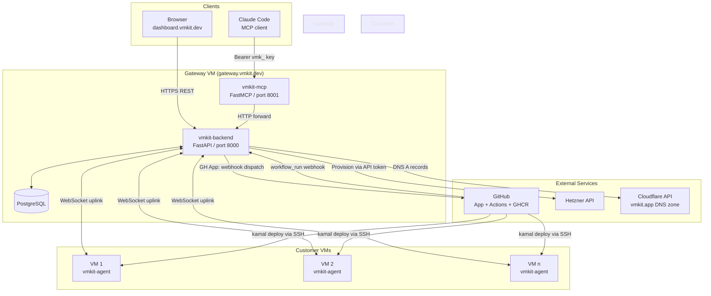

import { Callout, Steps } from 'nextra/components'

# Architecture

This page is for contributors, operators, and anyone who wants to understand how VMKit is built before extending or debugging it. It covers all five components, how they connect, the request lifecycle for a typical deploy, the security model, and how the system scales.

---

## Component Overview

| Component | Stack | Where it runs | What it owns |
|---|---|---|---|
| **vmkit-backend** | Python / FastAPI | Single gateway VM (`gateway.vmkit.dev`) | All business logic, DB, credential encryption, agent pool, webhook handling |
| **vmkit-mcp** | Python / FastMCP | Same gateway VM, separate process | MCP tool surface for agentic clients (Claude Code, etc.) |
| **vmkit-agent** | Go binary | Each customer VM | WebSocket uplink, log/metrics shipping, local harden + deploy execution |
| **vmkit-web** | Next.js / Cloudflare Pages | Cloudflare edge | Dashboard UI (`dashboard.vmkit.dev`) |
| **vmkit-ops** | Kamal 2 / Docker | Developer workstation (deploy target: gateway VM) | Dockerfiles, Kamal config, gateway cloud-init |

---

## System Diagram

---

## vmkit-backend

The backend is the system's brain. It is a Python FastAPI application that runs on a single gateway VM at `gateway.vmkit.dev`. Every operation in VMKit — whether triggered by a browser, the MCP layer, a GitHub webhook, or an agent heartbeat — flows through the backend.

**API surface.** The backend exposes REST routes grouped into functional areas: `/api/auth` for GitHub OAuth login and session management; `/api/compute-targets` for registering and managing cloud provider credentials; `/api/repos` for onboarding repositories and triggering scans; `/api/instances` for VM lifecycle operations; `/api/deploys` and `/api/environments` for deploy tracking and environment configuration; `/api/webhooks` for GitHub App event ingestion; and `/api/internal/*` for the orchestration steps that implement the deploy flow (provision, harden, create-instance, etc.). The internal routes are not exposed to the public internet.

**AI agents.** Three Claude Haiku-powered agents run inside the backend process. The `repo_scanner` analyzes repository contents to detect language, framework, and service dependencies. The `kamal_config_generator` produces a starter `config/deploy.yml` for Kamal based on the scan results. The `dockerfile_generator` produces a fallback `Dockerfile` when Buildpack detection is insufficient. The `gh_actions_generator` produces the `vmkit-deploy.yml` workflow that orchestrates the build and deploy on GitHub Actions. These agents run synchronously inside the onboarding flow; their outputs are committed to a pull request on the user's repo.

**Agent pool.** The backend maintains a WebSocket server endpoint that each `vmkit-agent` instance dials into on boot. The backend tracks all connected agents in-memory, keyed by VM ID. When it needs to execute a command on a VM (harden, fetch logs, collect metrics), it looks up the agent's WebSocket session and sends a typed RPC message. The agent executes the command locally and sends back a response. This pool is the live operational surface for all customer VMs.

---

## vmkit-mcp

The MCP gateway is a thin Python process that runs alongside the backend on the gateway VM. It exposes VMKit's capabilities as [Model Context Protocol](https://modelcontextprotocol.io/) tools, making them available to any MCP-compatible client — primarily Claude Code, but also any other agentic framework that speaks MCP.

Authentication uses `vmk_`-prefixed API keys. The client passes the key as a `Bearer` token in the `Authorization` header. The MCP layer validates that the key is well-formed and forwards it to the backend with every request; the backend performs the actual authorization check against the database.

The MCP layer contains essentially no business logic. Each tool maps to one or a small number of backend API calls. Tools include `scan_repo`, `harden_vm`, `deploy`, `get_logs`, `list_environments`, and others. The tool descriptions are written to be useful to a language model: they describe what the tool does, what parameters are required, and what the response means. This is the layer that makes VMKit "AI-native" — it is not just that Claude can call an API, it is that the tools are shaped for agentic consumption.

---

## vmkit-agent

The agent is a Go binary compiled to a static single-file executable. It is installed on each customer VM by the cloud-init script that runs on first boot. Systemd manages its lifecycle — it starts automatically on boot and restarts if it crashes.

The agent's primary responsibility is maintaining a persistent WebSocket connection to `gateway.vmkit.dev`. The connection is outbound-only: the agent dials out, not the backend. This pull model is a deliberate security and operational choice. Customer VMs do not need to accept inbound connections from the VMKit control plane, which means their firewall policy can be strict: only ports 80 and 443 open, nothing else. No allow-listing of VMKit IP ranges, no security groups to configure.

The agent's handlers implement the commands the backend can request over the WebSocket session:

- **`register`** — initial handshake, sends VM metadata (OS, architecture, agent version) to the backend
- **`harden`** — creates the `kamal` OS user, grants it Docker socket access, tightens SSH configuration, and disables root login
- **`logs_fetch`** — tails container logs for a specified service and streams them back to the backend
- **`metrics_collect`** — samples CPU, memory, disk, and network metrics and sends a snapshot
- **`agent_upgrade`** — downloads a new agent binary from a signed URL, verifies the checksum, replaces the running binary, and restarts via systemd
- **`deploy`**, **`destroy`**, **`compose`**, **`backup`**, **`tls`**, **`nginx`**, **`openport`**, **`resetvm`**, **`rotatecreds`**, **`diagnose`**, **`enabletls`** — operational handlers for the full VM management surface

The Go runtime adds minimal overhead; the agent idles at under 20 MB of resident memory and near-zero CPU between operations.

---

## vmkit-web

The dashboard is a Next.js application deployed to Cloudflare Pages at `dashboard.vmkit.dev`. It is a pure client-side application that talks to `gateway.vmkit.dev` via REST.

The page structure mirrors the data model: repos list → repo detail → environments → environment detail (deploy modal, environment variables, addon management); instances list; deploys list → deploy detail with log streaming; settings (profile, GitHub App connection, cloud provider credentials, API keys, team members, billing, notification preferences).

Cloudflare Pages is chosen for the frontend because it handles global CDN distribution, HTTPS, and zero-ops deployments — the same properties VMKit tries to give users for their own apps. The dashboard itself has no server-side compute; it is a static build that talks to the backend API.

---

## vmkit-ops

The ops repository contains the deployment infrastructure for VMKit itself: Dockerfiles for the backend, MCP gateway, and any auxiliary services; the Kamal 2 configuration that deploys those containers onto the gateway VM; and the cloud-init template used to bootstrap the gateway VM itself (Docker CE installation, SSH key injection, initial service startup).

This is the infrastructure-as-code layer that an operator uses to set up a new VMKit deployment or update the control plane. It is separate from the application code so that updates to the backend and ops configuration can be tested and deployed independently.

---

## Request Lifecycle

A typical deploy request, traced end to end:

<Steps>
### Client issues deploy

Claude Code calls `vmkit.deploy(repo="acme/invoicer", env="production")` via the MCP tool. The MCP process receives the request, validates the `vmk_` Bearer token, and forwards a `POST /api/internal/deploy` request to the backend with the token in the `Authorization` header.

### Backend checks onboarding state

The backend queries the database for the repo record. If `vmkit-deploy.yml` is absent from the repo, it calls the `gh_actions_generator`, `kamal_config_generator`, and `dockerfile_generator` agents, then opens a pull request on the repo via the GitHub App. The deploy is blocked until the PR is merged. If the workflow already exists, execution continues.

### Instance lookup or creation

The backend checks whether a VM already exists for this environment. If not, it calls the Hetzner API with the compute target credentials (decrypted from the database) to create a `cax11` instance. The cloud-init payload installs Docker CE and the `vmkit-agent` binary. The backend polls the agent pool until the new agent's WebSocket connection appears (up to 5 minutes).

### Harden over WebSocket

With an agent session established, the backend sends a `harden` RPC message. The agent creates the `kamal` user, grants Docker access, and hardens SSH. The backend waits for the acknowledgement before proceeding.

### DNS registration

The backend calls the Cloudflare API to create or update an A record for `{repo-slug}-{env-slug}.vmkit.app` pointing to the VM's IP address.

### Workflow dispatch

The backend calls the GitHub API to dispatch the `vmkit-deploy.yml` workflow on the repo. It passes environment variables including the VM's IP, the GHCR image tag, and references to secrets (SSH key, registry credentials) that were set up during onboarding.

### Build and deploy on GitHub Actions

GitHub's runners execute the workflow: Buildpacks builds the image and pushes to GHCR, then Kamal SSHs to the VM as the `kamal` user and performs a zero-downtime container swap using Traefik.

### Webhook completion

GitHub sends a `workflow_run.completed` webhook to `/api/webhooks`. The backend updates the deploy record status to `succeeded` or `failed`, attaches the Actions log URL, and the response propagates back through the MCP layer to Claude Code.
</Steps>

---

## Security Model

**Credential encryption.** All cloud provider API tokens and SSH private keys stored in the database are encrypted with AES-256-GCM. The encryption key is injected as an environment variable at backend startup and never persists to disk alongside the ciphertext. Credentials are decrypted in-process only at the moment they are needed for an API call.

**SSH key separation.** VMKit uses two distinct SSH keys with different trust scopes:

- The *gateway key* (`~/.ssh/id_ed25519`) is registered with Hetzner and used by the gateway VM itself for administrative access. Users never interact with this key.
- The *deploy key* (`~/.ssh/vmkit-deploy`) is generated per compute target. The private key is encrypted and stored as a database credential; the backend injects it as the `VMKIT_SSH_PRIVATE_KEY` GitHub Actions secret on the user's repo. The public key is written into the VM's `authorized_keys` via cloud-init. GitHub Actions uses this key to SSH into customer VMs as the `kamal` user during deploys. The key has no Hetzner registration and cannot be used to access the gateway VM.

**WebSocket pull model.** The backend never opens a TCP connection to a customer VM's IP address. All communication happens over the outbound WebSocket connection the agent establishes. This means customer VMs can — and should — block all inbound traffic except ports 80 and 443. The attack surface on customer VMs is the running application containers and the Traefik reverse proxy; the VMKit agent itself adds no inbound surface.

**GitHub App scope.** The VMKit GitHub App requests the minimum permissions needed: `contents: write` (to open PRs), `workflows: write` (to dispatch workflow runs), `secrets: write` (to set the deploy SSH key), and `metadata: read`. It does not request access to issues, pull request reviews, or repository contents beyond what's needed for onboarding.

<Callout type="warning">
The `vmk_` API keys that MCP clients use are scoped to a single VMKit user account. They are displayed once at creation time and stored as a salted hash in the database. If a key is compromised, rotate it immediately from the API Keys settings page — the old key is invalidated instantly.
</Callout>

---

## Scaling Considerations

**Control plane.** The backend runs as a single process on a single gateway VM. This is a deliberate simplicity choice for the current scale. The agent pool (in-memory WebSocket sessions) and the orchestration queue are both in-process. A failure of the gateway VM means all orchestration halts until it recovers, though customer VMs and their running applications are unaffected — they continue serving traffic independently.

**Customer VM pool.** Customer VMs scale horizontally. Each environment corresponds to one VM; each VM runs one `vmkit-agent` that maintains one WebSocket session in the backend's agent pool. There is no inherent limit on the number of concurrent agent sessions beyond the memory and file descriptor limits of the gateway VM process. At typical agent session memory cost (~1 MB per session), a 4 GB gateway VM can comfortably hold thousands of concurrent agent connections.

**Database.** The backend uses PostgreSQL. The database runs on the same gateway VM for simplicity; separating it to a managed database service (e.g., Hetzner Managed Databases) is the first scaling step for operators who need better durability or read scaling.

**Stateless customer VMs.** Customer VMs are treated as cattle, not pets. They can be destroyed and reprovisioned from scratch. Application state should live in a database or object storage service, not on the VM's local filesystem. VMKit's `resetvm` agent handler supports wiping and reprovisioning a VM while preserving the DNS record and environment configuration.

**Multi-region.** VMKit's current architecture has a single control plane region (wherever the gateway VM lives). Customer VMs can be in any Hetzner or DigitalOcean region that the user's compute target credentials have access to. True multi-region control plane replication is a future consideration; the WebSocket pull model makes it tractable (agents just need to know the address of a healthy backend endpoint), but it is not implemented today.
