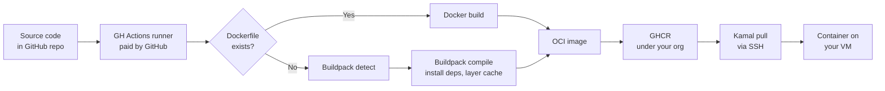

import { Callout } from 'nextra/components'

# Buildpacks: No Dockerfile Required

The containerization story most people know goes: write a Dockerfile, run `docker build`, push the image. That works, but it puts an unusual amount of knowledge on the developer. A correct Dockerfile for a Python application involves choosing the right base image, installing system dependencies in the right order, copying files in a layer-cache-friendly sequence, switching to a non-root user, setting the right entrypoint, and ideally doing a multi-stage build so the final image doesn't include the build toolchain. Most developers don't write Dockerfiles often enough to get all of that right by intuition, and bad Dockerfiles are a common source of security vulnerabilities, bloated image sizes, and slow builds.

Buildpacks solve this by extracting all of that expertise into a reusable, maintained program — one that knows more about your language ecosystem than most developers can justify knowing, and applies that knowledge automatically to every build.

VMKit uses [Paketo Buildpacks](https://paketo.io/), which are an implementation of the [Cloud Native Buildpacks (CNB) specification](https://buildpacks.io/) — the same spec that powers Heroku's build system and Google Cloud Run's source-based deploys.

---

## What a Buildpack Actually Does

A buildpack is a program that takes a directory of source code as input and produces an OCI-compliant container image as output. It runs in two phases:

**Detect:** the buildpack examines the directory and decides whether it can handle this source code. A Python buildpack checks for `requirements.txt` or `pyproject.toml`. A Node.js buildpack checks for `package.json`. If detection succeeds, the buildpack claims the source tree.

**Build:** the buildpack installs dependencies, compiles if necessary, and assembles a layered OCI image. It separates the dependency layer (which rarely changes) from the application layer (which changes on every push), so the dependency layer is cached and reused across builds. Only the layers that actually changed get rebuilt and re-pushed.

The result is an OCI image that runs identically in Docker locally, on your VM, on any other container runtime. There's no VMKit-specific runtime, no proprietary format — it's a standard container image that you can pull and run anywhere.

### The Packaging Model and Why It Matters

One underappreciated advantage of Paketo Buildpacks is their approach to base image updates. Buildpacks produce images with a clean separation between:

- The **run image** (the OS layer that the container runs on — Ubuntu Jammy in Paketo's case)
- The **build image** (the OS layer used during compilation)
- The **application layer** (your code and its dependencies)

When Canonical releases a security patch for Ubuntu Jammy, Paketo releases an updated run image. You can apply that update to your container via a process called **rebasing** — swapping out the OS layer without rerunning the build. That means security patches can be applied in seconds, without reinstalling your dependencies or recompiling your app. With a Dockerfile, an OS patch requires a full rebuild from scratch.

VMKit doesn't expose rebasing as a first-class operation yet, but the architecture supports it — and it's why the Paketo approach pays dividends over time compared to Dockerfile-based builds.

---

## Detection Logic

When a deploy is triggered, VMKit's `repo_scanner` agent (Claude Haiku) analyzes your repository to identify the language and pick a Buildpack builder. The detection cascade, in order:

1. **Dockerfile present?** If a `Dockerfile` exists in the repo root, skip Buildpacks entirely and use Docker build. No conflict, no ambiguity.
2. **Language detection:**

| Indicator file(s) | Detected language | Buildpack group |
|---|---|---|
| `requirements.txt`, `pyproject.toml`, `setup.py`, `Pipfile` | Python | `paketo-buildpacks/python` |
| `package.json` | Node.js | `paketo-buildpacks/nodejs` |
| `Gemfile` | Ruby | `paketo-buildpacks/ruby` |
| `go.mod` | Go | `paketo-buildpacks/go` |
| `Cargo.toml` | Rust | `paketo-buildpacks/rust` |
| `pom.xml`, `build.gradle` | Java / JVM | `paketo-buildpacks/java` |

3. **Procfile discovery:** if a `Procfile` exists, it is read to determine the process types (see below)
4. **Builder selection:** the detected language maps to a builder. Most workloads use `paketobuildpacks/builder-jammy-full` — the full Paketo builder that includes buildpack groups for all supported languages

The build runs inside the GitHub Actions workflow on GitHub's own runners, not on your VM. The VM only ever receives the finished container image via a `docker pull`.

---

## The Procfile

A Procfile is a plain text file in your repo root that declares the processes your application runs. It comes from the Heroku ecosystem and is the standard way to tell a buildpack-based deployment system what to execute.

The format is simple: one line per process type, in the form `<name>: <command>`.

```
web: uvicorn app.main:app --host 0.0.0.0 --port $PORT
worker: celery -A app.tasks worker --loglevel=info
beat: celery -A app.tasks beat --loglevel=info
```

Common examples by language:

```
# Python (FastAPI / Uvicorn)
web: uvicorn main:app --host 0.0.0.0 --port $PORT

# Python (Django)
web: gunicorn myproject.wsgi:application --bind 0.0.0.0:$PORT

# Node.js
web: node server.js

# Node.js (Next.js)
web: node .next/standalone/server.js

# Ruby (Rails with Puma)
web: bundle exec puma -C config/puma.rb

# Go (compiled binary)
web: ./myapp

# Background worker (Celery)
worker: celery -A myapp.celery worker --loglevel=info

# Scheduled tasks (Sidekiq)
worker: bundle exec sidekiq
```

Each process type in the Procfile becomes a separate Kamal service on your VM. The `web` process is the one Traefik routes public traffic to. `worker`, `beat`, `clock`, and any other named processes run as separate containers alongside the web process. They share the same image but start with different commands.

If you don't have a Procfile, the Paketo buildpack infers a reasonable default command from your language conventions (for Python, it looks for a `start` command in `pyproject.toml`; for Node.js, it looks at the `scripts.start` field in `package.json`). In practice, being explicit with a Procfile is almost always better than relying on inference.

<Callout type="info">
  The `$PORT` environment variable is injected by Traefik/Kamal and tells your app which port to listen on. Hardcoding a port number like `8000` in your Procfile will work locally but may conflict with other containers on the VM. Always use `$PORT` in the `web` process command.
</Callout>

---

## Build Pipeline in Context

Here is the full path from source code to running container:



A few things worth noticing in this diagram:

- The GH Actions runner is GitHub's infrastructure, not VMKit's and not yours. You're not paying for build compute in any direct sense (it's included in GitHub's free and paid plan allocations).
- GHCR acts as the intermediary — the image lands there before it ever touches your VM. This means if a deploy fails, the image is still in GHCR and a retry doesn't require a rebuild.
- The Kamal pull step is the only moment your VM connects outbound to an external service during a deploy. Everything else is coordinated over the vmkit-agent WebSocket or the GitHub Actions environment.

---

## When You Need a Dockerfile Anyway

Paketo Buildpacks cover the common cases well, but there are legitimate reasons to reach for a Dockerfile:

**Custom base image.** If your workload requires CUDA drivers for GPU inference, or a specific version of a system library that isn't in the Paketo Ubuntu base, you need a custom base image and that means a Dockerfile.

**Non-standard languages or runtimes.** Paketo doesn't cover every language. If you're running a Nim, Zig, Elixir, or Erlang application, you'll need to write your own build instructions.

**Unusual build pipelines.** If your build requires fetching private artifacts, invoking a code generator, or compiling against a specific toolchain version that the Paketo buildpack doesn't expose as a configuration option, a Dockerfile gives you full control.

**Monorepos with multiple apps.** Buildpacks assume a single-app repository. If your repo contains multiple services, you'll need either a Dockerfile (or multiple Dockerfiles) with a build argument to select the service, or you'll need to reorganize your repo structure.

When VMKit detects a `Dockerfile`, it switches the build step to `docker build --file Dockerfile` and the Buildpack step is skipped entirely. The resulting image is still pushed to GHCR and deployed via Kamal in the same way — only the image production step changes.

<Callout type="default">
  Having a `Dockerfile` does not mean you lose any VMKit features. DNS management, TLS, zero-downtime deploys, log streaming, and rollbacks all work exactly the same way. The only change is how the container image is produced.
</Callout>

---

## Layer Caching and Build Speed

One practical consequence of the Buildpack architecture is predictable build times. Because the dependency layer (your `requirements.txt` install, your `npm install`, your `bundle install`) is a separate OCI layer, it's cached in GHCR between builds. If you push a commit that only changes application code and not dependencies, the build step for dependencies is a cache hit — it takes seconds, not minutes.

With a Dockerfile, whether the cache hits depends on how carefully you've ordered your `COPY` and `RUN` instructions. Buildpacks always get the layering right because they manage it internally, without any configuration required from you.

In practice, for a medium-sized Python application:
- First build (cold): 3–5 minutes (installing all packages)
- Subsequent builds (code change only): 45–90 seconds (dependency layer cached)
- Subsequent builds (dependency added): 2–4 minutes (dependency layer rebuilt from the change)

The first build of any new repo is always the slowest. Once the layers are cached in GHCR, the iteration cycle is fast enough that it doesn't feel like a bottleneck in normal development.
