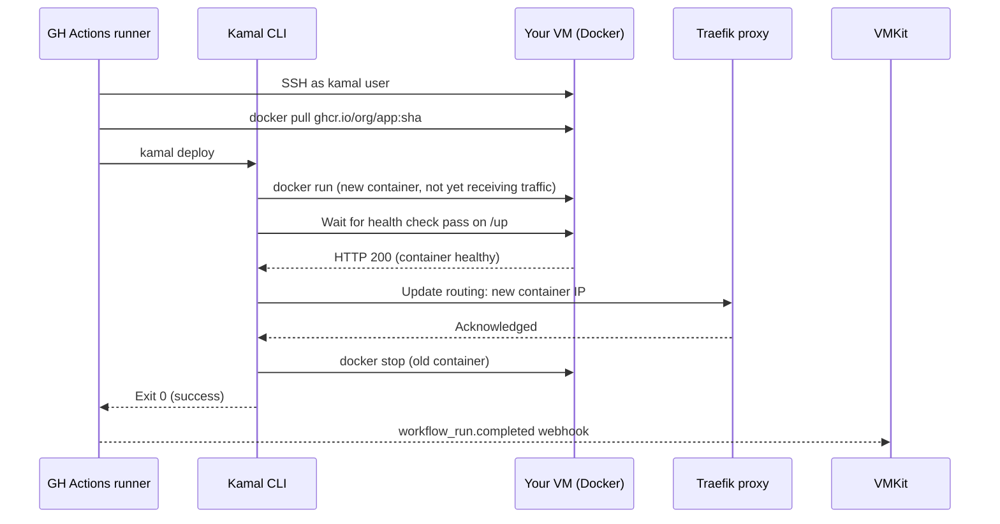

import { Callout } from 'nextra/components'

# Kamal: How VMKit Deploys

Every time you push code to a VMKit-connected repo, a deployment eventually reaches a point where a new container has to replace the old one on your VM. That transition — pulling the new image, starting the new container, routing traffic to it, draining the old one — is handled by [Kamal](https://kamal-deploy.org/), an open-source deployment tool built and maintained by [37signals](https://37signals.com/), the company behind Basecamp and Hey.

Kamal is not a VMKit abstraction. It's a real, independent tool with its own documentation and community. VMKit generates Kamal configuration on your behalf and wires it into your GitHub Actions workflow, but the deployments themselves run standard Kamal commands against your VM — commands you could run manually in a terminal if you wanted to.

Understanding Kamal is not required to use VMKit. But if you've ever wondered what's happening inside a deploy, or why a particular deployment decision was made, this page answers those questions.

---

## What Kamal Is

Kamal is a deployment tool for containerized applications that runs on any server with Docker and SSH. Its philosophy is deliberately minimal: it orchestrates `docker run` and `docker stop` commands over SSH, adds a Traefik reverse proxy for zero-downtime traffic routing, and manages environment variables and registry authentication as encrypted secrets.

It has no cluster to maintain. No etcd. No control plane process running on the server consuming resources. No proprietary runtime or agent that has to be healthy before deploys can proceed. When Kamal is not deploying, the only Kamal-related process on your VM is the Traefik container — a lightweight Go reverse proxy.

The design reflects the 37signals philosophy: most web applications don't need the machinery of Kubernetes. They need a reliable way to swap containers without dropping requests, with a proxy that handles TLS, and a simple mental model the entire team can hold in their heads. For a single VM running a containerized app (which is exactly VMKit's target), Kamal is an excellent fit.

### Why Not Kubernetes?

Kubernetes gets raised as a comparison point often enough to address directly. For the scale VMKit targets — solo developers, indie hackers, small teams, single-VM deployments — Kubernetes is genuinely too much machinery.

The Kubernetes control plane components (API server, etcd, controller manager, scheduler) consume a meaningful fraction of a `cax11`'s 4 GB RAM before your application starts. You'd need a larger instance just to run the platform, which defeats the economics of BYOS. And the operational surface of a Kubernetes cluster — certificate rotation, etcd backups, node pool upgrades — is substantial ongoing work for a team that may have no dedicated operations function.

Kamal's footprint on a running VM is the Traefik container (which uses well under 100 MB RAM) and whatever your application containers consume. That's it.

<Callout type="default">
  Horizontal scaling across multiple VMs requires multiple compute targets in VMKit — each environment corresponds to one VM. If you genuinely need container orchestration across many nodes, Kubernetes (or Fly.io, which wraps Kubernetes) is the honest answer. But most applications that developers ship never need that, and optimizing for a case that never arrives is just complexity you pay for every day.
</Callout>

---

## What VMKit Generates

For each repo and environment pair, VMKit's `kamal_config_generator` agent produces a `vmkit-deploy.yml` — a Kamal configuration file that gets opened as a pull request in your repository. Once you merge it, every subsequent deploy uses that config.

The generated config includes:

- **Registry configuration** — credentials and URL for your GHCR org, so Kamal can authenticate to pull your image
- **Server IP** — the IP address of the VM VMKit provisioned for this environment
- **Image reference** — `ghcr.io/your-org/your-app`, the OCI image Kamal will deploy
- **Environment variables** — passed through from the environment variables you configured in VMKit's dashboard, injected into the container at startup
- **Health check path** — the HTTP endpoint Kamal hits to confirm the new container is ready before routing traffic to it (defaults to `/up` if not specified)
- **Accessories** — any Postgres, Redis, or other sidecar services you've added to the environment, configured as Kamal accessories with persistent volumes
- **Traefik configuration** — TLS termination settings, host routing rules for your `app-env.vmkit.app` subdomain

You can read and edit this file. If you add an environment variable in the VMKit dashboard, it gets appended to the config on the next deploy. If you need to adjust the health check path because your app uses `/health` instead of `/up`, you can edit the file directly. Kamal configs are just YAML.

---

## The Deploy Sequence

When a deploy is triggered — whether by a git push, a dashboard button, or an MCP tool call — the following sequence runs on the Kamal side:



The critical insight is what happens at the "update routing" step. Traefik's job is to hold an accurate mapping of virtual hosts to backend containers. During the window between "new container started" and "old container stopped," both containers are running on the VM simultaneously. Traefik routes traffic exclusively to the new one (once its health check passes) while the old one finishes handling any in-flight requests before being stopped. From a user's perspective, there is no interruption — the cutover is invisible.

This is what "zero-downtime" means in practice. It's not magic; it's a brief period of parallel operation managed by a proxy that makes the transition atomic from the outside.

---

## Zero-Downtime in More Detail

The zero-downtime guarantee depends on a few things being true:

**The new container must pass its health check.** If the health check endpoint returns a non-2xx status, Kamal stops the deploy without cutting over traffic. The old container continues running, and the deploy is marked failed. This is the right behavior — it means a bad deploy doesn't take down your app, it just fails to replace it.

**Requests in flight complete before the old container stops.** Traefik gives in-flight requests a grace period to complete before it stops the old container. Long-running requests (WebSocket connections, streaming responses, slow uploads) should be designed with this in mind; Traefik's drain window is configurable in the Kamal accessories section of your config.

**Stateful local state doesn't survive the container swap.** If your application holds in-memory session state or a local file that it writes to, that state is lost when the old container stops. This is standard container behavior, not a Kamal limitation. Use Redis for session storage and accessories (with persistent volumes) for any data that must survive deploys.

---

## Rollbacks

Kamal doesn't have a native rollback concept — and this is actually a deliberate design decision, not a missing feature. In Kamal's model, a "rollback" is just a deploy of an older image. There's nothing special about it.

VMKit implements rollbacks by re-dispatching the GitHub Actions workflow with the previous image SHA pinned as an input. Kamal receives a standard `kamal deploy` with an explicit image tag pointing to the previous version (which is already in GHCR — GHCR doesn't delete images unless you explicitly prune them). It runs the same sequence: pull, start, health check, cut over, drain old.

The result is indistinguishable from a forward deploy from Kamal's perspective. The rollback is fast — under a minute in most cases — because the previous image is already cached on the VM from the prior deploy.

---

## Database Migrations

The interaction between deployments and database migrations is one of the most common sources of production incidents, and Kamal has a specific mechanism for it: the `release` hook.

A release hook is a command that runs once before the new containers start — after the image is pulled but before the cutover. It runs in a temporary container using the new image, which means it can access new migration code. If the release command exits non-zero, Kamal aborts the deploy before touching the running containers.

VMKit checks for a `release` hook in your `vmkit-deploy.yml` and, if present, executes it automatically as part of the deploy sequence. If you're running a Django app, the release hook would be:

```yaml
# in vmkit-deploy.yml
release:
  - python manage.py migrate --no-input
```

For Rails:

```yaml
release:
  - bundle exec rails db:migrate
```

<Callout type="warning">
  Always write migrations that are backward-compatible with the previous version of your application code. The zero-downtime deploy means there is a brief window where the old container is still running against the newly migrated database. If a migration drops a column the old code reads, the old container will error during that window. The safe pattern: add columns in one deploy, stop reading the old column in the next, drop the old column in a third deploy.
</Callout>

---

## Accessories: Sidecars as First-Class Citizens

Kamal has a concept called **accessories** — services that run alongside your application on the same VM, managed by the same deployment tool, but with distinct lifecycles. A Postgres database is the canonical example: it needs a persistent volume, it shouldn't be restarted every time you deploy your app, and it needs to expose a port that your app can reach.

When you add Postgres or Redis to an environment in the VMKit dashboard, VMKit adds the corresponding accessory stanza to your `vmkit-deploy.yml`:

```yaml
accessories:
  db:
    image: postgres:16-alpine
    host: <%= ENV["SERVER_IP"] %>
    port: 5432
    env:
      POSTGRES_PASSWORD: <%= ENV["POSTGRES_PASSWORD"] %>
    volumes:
      - postgres_data:/var/lib/postgresql/data
  cache:
    image: redis:7-alpine
    host: <%= ENV["SERVER_IP"] %>
    port: 6379
```

VMKit injects the `DATABASE_URL` and `REDIS_URL` environment variables into your application container so it can connect to the accessories without any manual configuration.

<Callout type="warning">
  Never run stateful processes — databases, object storage, queues — in the main application container. That container gets replaced on every deploy. Data written to its filesystem is lost when the container stops. Accessories have persistent Docker volumes that survive deploys, restarts, and even Kamal upgrades. If you're storing data that must survive a deploy, it belongs in an accessory.
</Callout>

Kamal manages accessory lifecycle separately from application lifecycle. `kamal accessory reboot db` restarts the Postgres container without touching your application. `kamal accessory exec db -- psql -U postgres` gives you a database shell. These operations don't trigger a full application deploy.

---

## Reading Kamal Output

When a deploy fails, the GitHub Actions log contains the full Kamal output. Knowing how to read it can save significant debugging time.

Kamal's output follows a consistent pattern:

- Lines prefixed with `INFO` are informational — image pull progress, container start confirmations
- Lines prefixed with `WARN` are worth reading but not necessarily fatal
- Lines prefixed with `ERROR` indicate something went wrong
- A non-zero exit code from `kamal deploy` always triggers the GitHub Actions step to fail, which triggers VMKit's webhook handler to mark the deploy as failed

Common failure modes and what they look like in Kamal output:

| Error pattern | Likely cause |
|---|---|
| `Health check failed` | App didn't start, wrong health check path, or app crashed on startup |
| `Error response from daemon: no space left on device` | VM disk full — run `docker system prune` on the VM |
| `permission denied (publickey)` | SSH key not on the VM or wrong user — check `kamal user` in config |
| `Pulling from ghcr.io/... 401 Unauthorized` | GHCR token expired or wrong `GHCR_TOKEN` secret |
| `release command failed` | Migration command exited non-zero — check migration logs |

VMKit surfaces the GitHub Actions log URL in the deploy status response, so if a deploy fails, you can navigate directly to the log without hunting through the GitHub UI.
