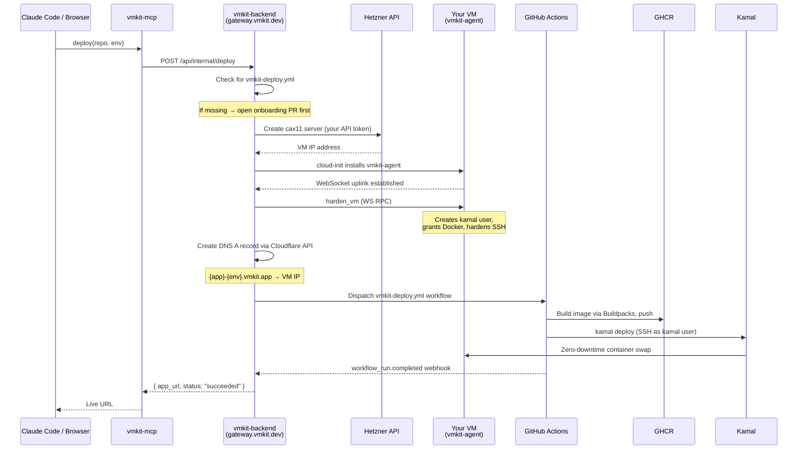

import { Callout, Steps } from 'nextra/components'

# How It Works

VMKit is not a runtime. It does not run your containers. It does not own your servers. It is a thin orchestration layer that sits between the tools you already trust — GitHub, Hetzner, Kamal, Cloud Native Buildpacks — and wires them together into a single, coherent deploy flow.

When you deploy with VMKit, your code goes through GitHub Actions, your image lands in your GitHub org's container registry, and your container runs on a VM that was provisioned with your own cloud provider API key. VMKit's control plane coordinates all of that. It never touches your code directly, and it never charges you for compute it doesn't own.

That's the mental model: VMKit as conductor, not cloud provider.

---

## The Deploy Flow, Step by Step

Here is exactly what happens when you call `vmkit.deploy(repo, env)` — whether from Claude Code via MCP, from the dashboard, or directly via the API.



The entire sequence — from a cold server to a live URL — typically completes in under ten minutes. Most of that time is the VM boot and the Buildpack image build; the orchestration overhead is negligible.

<Steps>
### Onboarding check

Before provisioning anything, VMKit checks whether your repo already has a `vmkit-deploy.yml` GitHub Actions workflow. If it doesn't, VMKit opens a pull request that adds the workflow file, a starter Kamal config, and any environment variable stubs it detected during the repo scan. You merge the PR, and then the deploy proceeds. This happens exactly once per repo.

### VM provisioning

VMKit calls the Hetzner API (using the credentials you registered as a compute target) to create a `cax11` instance — a 2 vCPU ARM64 VM. The request includes a cloud-init script that installs Docker CE, downloads the `vmkit-agent` binary, and writes a systemd unit that starts it on boot. VMKit then polls until the agent's WebSocket connection appears at the backend.

### VM hardening

Once the agent is connected, the backend sends a `harden_vm` command over the WebSocket RPC channel. The agent executes it locally: it creates a `kamal` OS user, grants that user access to the Docker socket, and tightens SSH configuration (disabling root login and password auth). This is the state the VM needs to be in for Kamal to deploy to it.

### DNS registration

With the VM IP in hand, the backend creates a DNS A record in the `vmkit.app` Cloudflare zone: `{app}-{env}.vmkit.app → VM IP`. This record exists for the lifetime of the environment and is deleted when you tear down the VM.

### GitHub Actions dispatch

The backend dispatches your `vmkit-deploy.yml` workflow via the GitHub API. That workflow runs on GitHub's own runners (not your VM): it uses Cloud Native Buildpacks to build a container image, pushes it to GHCR under your GitHub org, then SSH-es to your VM as the `kamal` user and runs `kamal deploy`.

### Webhook completion

GitHub sends a `workflow_run.completed` event to the VMKit webhook endpoint. The backend marks the deploy as succeeded (or failed, with the Actions log URL attached) and the result propagates back to whoever triggered the deploy.
</Steps>

---

## Your VM, Your Data

<Callout type="info">
VMKit never clones, reads, or stores your source code. Your container images are pushed to GHCR under **your** GitHub org. Your VM is created with **your** cloud provider API key, and only you can destroy it. VMKit's role is coordination — it holds credentials in encrypted form and issues instructions on your behalf.
</Callout>

This is what "Bring Your Own Server" means in practice:

- **Compute credentials stay encrypted.** When you register a Hetzner or DigitalOcean API key as a compute target, it is encrypted at rest in the VMKit database using AES-256-GCM with a key that never leaves the backend process. VMKit uses it to call the provider API; it is never exposed in logs or API responses.
- **Images land in your org.** Cloud Native Buildpacks pushes to `ghcr.io/{your-github-org}/{repo-name}`. VMKit has no access to that registry beyond what your GitHub App installation grants it for workflow dispatch.
- **VMs outlive VMKit.** If you stop using VMKit tomorrow, your VMs keep running. You can SSH in, remove the `vmkit-agent` systemd unit, and operate the server independently. There is no proprietary runtime baked in.

The flip side of BYOS: VMKit can only provision VMs in regions your cloud provider supports, at the instance sizes VMKit knows about. The current default is Hetzner `cax11`. More sizes and providers are on the roadmap.

---

## The Agent on Your VM

Every VM VMKit provisions runs a small Go binary called `vmkit-agent`. It has one primary job: maintain a persistent WebSocket connection back to `gateway.vmkit.dev` and execute commands the backend sends down that connection.

The architecture is deliberately pull-based. The agent calls out to the backend — not the other way around. This means:

- **No inbound firewall rules needed on your VM.** The agent opens an outbound WebSocket connection on port 443. Your VM's firewall can block all inbound traffic except ports 80 and 443 (HTTP/HTTPS for your app) and still function perfectly.
- **Firewalled networks work fine.** If your VM is behind a corporate proxy or a strict NAT, the agent still connects. There's no assumption of a public IP being reachable by the control plane.
- **The backend never initiates a connection to your VM's IP.** All orchestration happens over the established WebSocket session. This is meaningfully different from tools that SSH into your VM from a central server, which requires your VM to accept inbound SSH from a known IP range.

Beyond the WebSocket uplink, the agent handles:

- **Log streaming.** The `logs_fetch` handler tails container logs and ships them to the backend, which makes them available in the dashboard and the MCP `get_logs` tool.
- **Metrics collection.** The `metrics_collect` handler gathers CPU, memory, and disk usage at a short interval and pushes snapshots to the backend for the dashboard overview.
- **Health signaling.** A heartbeat over the WebSocket connection lets the backend know whether the agent is alive. A missing heartbeat triggers an alert in the dashboard.
- **Self-upgrade.** The `agent_upgrade` handler lets the backend push a new agent binary without SSHing into the VM. The agent downloads the new binary, verifies its checksum, replaces itself, and restarts via systemd.

The agent is intentionally minimal. It does not run your application, manage your containers directly, or make decisions about deployments. That logic lives in the backend, and the agent is just the execution arm on the VM side.

---

## Build Pipeline

VMKit uses [Cloud Native Buildpacks](https://buildpacks.io/) to turn your source code into a runnable OCI container image. You do not need a Dockerfile.

When you add a repo, VMKit's `repo_scanner` agent (powered by Claude Haiku) analyzes the repository contents and identifies the language, framework, and any services it depends on. It uses this to select a Buildpack builder and generate a starter Kamal config.

The actual build happens inside your GitHub Actions workflow, on GitHub's runners:

```yaml
- name: Build image
  uses: docker/build-push-action@v6
  with:
    # Buildpacks builder — no Dockerfile in your repo
    builder: paketobuildpacks/builder-jammy-full
    push: true
    tags: ghcr.io/${{ github.repository_owner }}/${{ github.event.repository.name }}:latest
```

Buildpacks detect and handle:

| Language | What's detected |
|---|---|
| Python | `requirements.txt`, `pyproject.toml`, `Pipfile` |
| Node.js | `package.json` (including Next.js, Remix, Express) |
| Ruby | `Gemfile` |
| Go | `go.mod` |
| Rust | `Cargo.toml` |
| Java | `pom.xml`, `build.gradle` |

The resulting image is OCI-compliant and pushed to GHCR. Because it's a standard container image, you can pull and run it locally with `docker run` at any point — there's no VMKit-specific runtime involved.

If Buildpack detection fails (for unusual stacks, monorepos, or projects with custom build steps), you can add a `Dockerfile` to your repo and VMKit's generated workflow will use it automatically. The Buildpack step is skipped when a Dockerfile is present.

---

## Zero-Downtime Deploys

VMKit uses [Kamal](https://kamal-deploy.org/) to manage container deployments on your VM. Kamal is the same tool that deploys Basecamp and Hey — a small, opinionated CLI that knows how to swap containers with zero downtime.

The deploy sequence Kamal runs on each push:

1. Pull the new image from GHCR onto the VM
2. Start the new container alongside the running one
3. Wait for the new container to pass its health check
4. Tell Traefik to route traffic to the new container
5. Stop and remove the old container

Step 4 is what makes it zero-downtime. Traefik is a reverse proxy that Kamal installs and manages. It handles incoming HTTP/HTTPS traffic and routes requests to the currently healthy container. During a deploy, it holds connections open until the new container is ready, then cuts over — no dropped requests, no 502s.

<Callout type="default">
Kamal was chosen over Kubernetes because the target environment is a single VM, and Kubernetes is genuinely too much machinery for that use case. A `cax11` instance has 2 vCPUs and 4 GB RAM; running a Kubernetes control plane would consume a meaningful fraction of those resources before your app even starts. Kamal's footprint is a single binary and a Traefik container. The tradeoff is that horizontal scaling across multiple VMs requires multiple compute targets — VMKit manages this with environments, where each environment corresponds to one VM.
</Callout>

---

## DNS and TLS

Every environment gets a subdomain under `vmkit.app`:

```
{repo-slug}-{env-slug}.vmkit.app
```

For example, a repo named `invoicer` with an environment named `production` gets `invoicer-production.vmkit.app`.

DNS is managed by the VMKit backend using the Cloudflare API against the `vmkit.app` zone. When you create an environment and provision a VM, the backend creates an A record pointing to the VM's IP. When you delete the environment, the record is deleted. The whole cycle is automatic — you never touch a DNS panel.

TLS is handled by Traefik on the VM using Let's Encrypt. Traefik watches for new virtual hosts, requests a certificate from Let's Encrypt via ACME, and serves HTTPS automatically. The first HTTPS request to a fresh environment may take a few seconds while the certificate is issued; subsequent requests are served from the cache.

The `vmkit.app` wildcard is a deliberate choice. Serving from a wildcard domain that VMKit controls means:

- No DNS delegation required from you to get a working HTTPS URL
- Certificates are issued and renewed automatically without any configuration
- You can test your app at a real HTTPS URL the moment the deploy completes

Custom domains (your own `app.yourdomain.com`) are on the roadmap. The architecture already supports it — Traefik can serve any hostname — it's a matter of the backend supporting CNAME verification and certificate provisioning for external domains.
