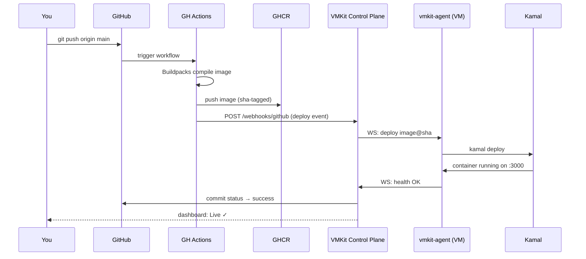

import { Callout, Steps, Tabs } from 'nextra/components'

# Quickstart

By the end of this guide you'll have a live URL — something like `https://my-fastapi-app-staging.vmkit.app` — running on a VM you own, deploying automatically on every push to `main`. The whole thing takes about ten minutes.

<Callout type="default">
  **Prerequisites**

  - A GitHub account (VMKit uses GitHub OAuth and the GitHub App for repo access)
  - A Hetzner or DigitalOcean VM — a Hetzner **CAX11** (ARM64, 2 vCPU, 4 GB RAM, ~$4.50/mo) is the recommended starting point
  - A VMKit account — sign up at [dashboard.vmkit.dev](https://dashboard.vmkit.dev)
</Callout>

---

<Steps>

### Sign in with GitHub

Go to [dashboard.vmkit.dev](https://dashboard.vmkit.dev) and click **Sign in with GitHub**. VMKit uses GitHub OAuth so there's no separate password to manage.

After authenticating, the GitHub App installation screen will appear. Grant VMKit access to the repositories you want to deploy — you can start with one repo and add more later. VMKit only requests the permissions it needs: reading repo contents to scan for buildpack compatibility, and writing deployment statuses back to commits.

### Connect a cloud provider

VMKit needs to know where to provision VMs. Head to **Settings → Cloud Providers → Add Provider**.

<Tabs items={['Hetzner', 'DigitalOcean']}>
  <Tabs.Tab>
    1. Log in to the [Hetzner Cloud Console](https://console.hetzner.cloud/) and open your project.
    2. Go to **Security → API Tokens → Generate API Token**. Choose **Read & Write**.
    3. Copy the token and paste it into VMKit.

    VMKit will verify the token by listing your Hetzner projects. If the token is valid, you'll see a green checkmark and your Hetzner project name.
  </Tabs.Tab>
  <Tabs.Tab>
    1. Log in to the [DigitalOcean Control Panel](https://cloud.digitalocean.com/) and go to **API → Generate New Token**.
    2. Give it a memorable name (e.g. `vmkit`), set scope to **Read + Write**.
    3. Copy the token and paste it into VMKit.

    VMKit will verify by listing your DigitalOcean regions and confirming the token has sufficient permissions.
  </Tabs.Tab>
</Tabs>

<Callout type="info">
  VMKit stores provider tokens encrypted at rest. The token is only used to provision and manage VMs in your account — VMKit never spins up resources without an explicit deploy or environment creation action from you.
</Callout>

### Connect a repo

Go to **Repos → Connect Repo**. VMKit shows you all repositories the GitHub App has access to. Pick the one you want to deploy.

Once selected, VMKit scans the repository using [Cloud Native Buildpacks](https://buildpacks.io/) to detect the language and runtime. You'll see something like:

```
Detected: Python 3.12 (Procfile: web: uvicorn app.main:app --host 0.0.0.0 --port $PORT)
```

If VMKit can't detect your language automatically, check the [Buildpacks guide](/concepts/buildpacks) for how to add a `Procfile` or `runtime.txt`.

No Dockerfile needed. Buildpacks handle the container image entirely.

### Create an environment and deploy

In your repo's page, go to **Environments → New Environment**. Give it a name — `staging` is a good starting point for most projects.

VMKit will ask you to confirm the VM size. The CAX11 default works well for most apps in early stages. Click **Deploy**.

Here's what happens next, in the background:

1. VMKit calls your cloud provider API to provision a fresh VM.
2. It SSHs in, installs `vmkit-agent`, and registers the VM with the control plane.
3. GitHub Actions is triggered on your repo's `main` branch.
4. Buildpacks compile your app into a container image and push it to GHCR.
5. Kamal pulls the image onto your VM and starts it behind a Traefik reverse proxy.
6. A TLS certificate is issued automatically via Let's Encrypt.

The first deploy usually takes 5–8 minutes. Subsequent deploys (image already cached) take 60–90 seconds.

When it finishes, the dashboard shows a green **Live** badge and your URL:

```
https://my-fastapi-app-staging.vmkit.app
```

<Callout type="info">
  The URL pattern is always `{repo-slug}-{environment-slug}.vmkit.app`. If you named your repo `my-fastapi-app` and your environment `staging`, that's exactly the URL you get — no configuration required.
</Callout>

### (Optional) Set up MCP for Claude Code

This step lets you deploy, check logs, and manage environments directly from Claude Code using natural language — no browser required.

**Create an API key:** Go to **Settings → API Keys → Create Key**. Give it a name like `claude-code`. Copy the token — it starts with `vmk_`.

**Add VMKit to your MCP config:** Open or create `~/.claude/mcp.json` and add the VMKit server:

```json
{
  "mcpServers": {
    "vmkit": {
      "command": "uvx",
      "args": ["vmkit-mcp"],
      "env": {
        "VMKIT_API_KEY": "vmk_your_token_here"
      }
    }
  }
}
```

Restart Claude Code. You can now talk to VMKit from your editor:

```
Deploy my-fastapi-app to staging
```

```
Show me the last 50 lines of logs for my-fastapi-app on staging
```

```
What's the status of my environments?
```

See the [MCP Setup guide](/guides/mcp-setup) for the full list of available tools and how to use them in agentic workflows.

</Steps>

---

## What Just Happened

The deploy you just ran follows this sequence every time you push to `main`:



The `vmkit-agent` running on your VM is the critical link. It maintains a persistent WebSocket connection to the VMKit control plane, so deploys don't require the control plane to reach into your VM — the VM reaches out. This means your VM doesn't need a public IP exposed beyond the Traefik-managed ports (80, 443).

---

## Troubleshooting

<Callout type="warning">
  **Deploy is stuck on "Provisioning" or "Building"?**

  - Check the **Deploy Logs** tab on the environment page — every step is logged in real time, including buildpack output and Kamal's output.
  - If the VM provisioned but the agent never came online, SSH into the VM and check `journalctl -u vmkit-agent -f` to see why the agent failed to connect.
  - If Buildpacks failed to detect your language, confirm you have a `Procfile` at the repo root. A minimal Python example: `web: uvicorn app.main:app --host 0.0.0.0 --port $PORT`.
  - If the deploy succeeded but the URL returns a 502, your app is probably not binding to `0.0.0.0` or not reading the `PORT` environment variable. VMKit injects `PORT=3000` by default.
</Callout>

---

## Next Steps

- [How It Works](/how-it-works) — understand the full architecture before you go deeper
- [Custom Domains](/guides/custom-domains) — bring your own domain instead of the `.vmkit.app` subdomain
- [Services](/guides/services) — add Postgres or Redis alongside your app in one click
- [MCP Setup](/guides/mcp-setup) — the full MCP tool reference for Claude Code workflows
